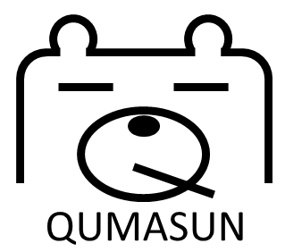

# QUMASUN

QUMASUN is quantum material simulation code on Density Functional Theory (DFT) and Time-Dependent Density Functional Theory (DFT). In particular, the movement of nuclei with wave function of electrons is also focused, which is called the Ehrenfest Molecular Dynamics.

# Feature

- Source code and library
  - C++ and a program is parallelized with MPI.
  - Required library: BLAS, LAPACK, ScaLAPACK, FFTW
- DFT/TDDFT common feature: 
  - Wave function: represented by a real space grid with periodic boundary 
    - Note: our development is toward a better combination of real-space grids and plane-wave systems to increase accuracy. 
  - Exchange correlation: supporting only LDA(LSDA). 
  - Pseudo-potential: MBK scheme potential, generated by “ADPACK” and supplied for DFT code “OpenMX”. 
- TDDFT feature:  
  - w/o K-point sampling: only gamma point 
  - Dynamics support: Time dependent Kohn-Sham eq., Ehrenfest MD 
  - Calculation cost: O(N2) 
  - Parallelization: domain decomposition, spin parallel, state parallel 
- DFT feature: 
  - SCF iteration: Solving Kohn-Sham eq. with LOBPCG method. 
  - K-point sampling: supported
  - Dynamics support: MD, structure relaxation 
  - Calculation cost: O(N3) 
  - Parallelization: domain decomposition, k-point parallel, and spin-parallel

# How to use

TBD

  

# LICENSE

Copyright (c) 2023-2024 Atsushi M. Ito

This project is licensed under the MIT License, see the `manual/LICENSE.txt` file for details.

# Privacy Policy

- This application (QUMASUN) and developer do not collect any personal information or privacy-related information about user. 
- The application and developer do not collect information of keyboard typing by user. 
- The application and developer do not collect the information of files opened by the application.
